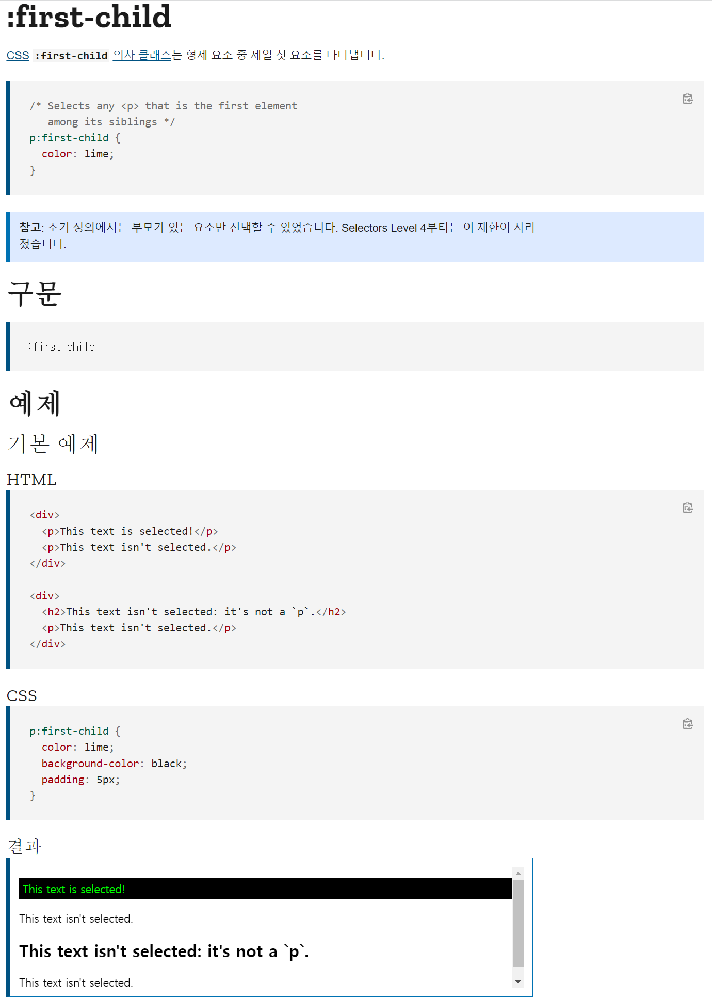
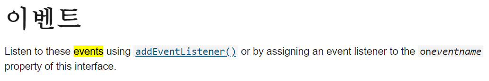

## Vanilla JavaScript

브라우저(매끈한 면)

HTML (접착제)

CSS와 JS (짜잔)

---

const (변하지 않는)

```javascript
const myName = 'June';
// camelCase

// _는 파이썬 (snake_case)
// my_name = 'June'
```

---

let (변할 수 있는)

```javascript
let myName = 'June';
.
.
.
myName = 'JuneJune';
```

**const `항상`**

**let `가끔`**

**var `절대X`**

---

= true 켜짐

= false 꺼짐

= null 비어있음

```javascript
let something;
// undefined 메모리에 변수는 만들어졌고 컴퓨터가 이 변수에 대해서 인지하고 있는데, 값이 없음
```

---

```javascript
const daysOfWeek = ['mon', 'tue', 'wed', 'thu', 'fri', 'sat' ];

// Get Item from Array
console.log(daysOfWeek); 

// Add one more day to the array
daysOfWeek.push('sun');

console.log(daysOfWeek);

console.log(daysOfWeek[12345]);
// undefined
```

---

### Object : property를 가진 데이터를 저장하도록 해줌

```javascript
const player = {
  name: 'June',
  points: 123,
  fat: true,
};
console.log(player);
console.log(player.name);
console.log(player['points']);

player.fat = false;
player.lastName = 'Hou';
player.points = player.points + 12;
console.log(player);
// player 자체를 통으로 바꾸는게 아니라 그안(object)의 무언가를 업데이트 하는 것이어서 문제 X
// 추가하고 싶으면 그냥 작성해주면 됨
```

---

### Function

```javascript
function sayHello(nameOfPerson, age) {
  console.log("Hello my name is " + nameOfPerson + " and I'm " + age);
};

sayHello('June', 234)

const player2 = {
  name: 'niconiconi',
  sayHello: function (otherPersonName) {
    console.log('hello ' + otherPersonName + ' nice to meet you!');
  },
};

console.log(player2.name);
player2.sayHello('muyaho');
```

---

### Conditionals

```javascript
const age1 = prompt('How old are you?');
const age2 = parseInt(prompt('How old are you?'));
// 구식이라 쓰지 않음(prompt), 디자인 변경도 안되고 딱딱함!

console.log(age2);

console.log(typeof age1);

console.log(age1, parseInt(age1));

console.log(isNaN(age1));

if (isNaN(age1) || age1 < 0) {
  console.log('Please write a real positive number');
} else if (age1 < 18) {
  console.log('You are too young!');
} else if (age1 >= 18 && age1 <= 50) {
  console.log('You can drink!');
} else {
  console.log("You can't drink!");
}

// === (같다면)
// !== (같지 않다면)
```

---

### The Document Object


---

### HTML in Javascript / Searching For Elements

```javascript
const title = document.getElementById("title");
console.log(title);
console.dir(title);
// dir은 해당하는 것의 내부구조를 전부다 보여줌! [사용가능한 event도 보여줌!]

title.innerText = "Got You!";

console.log(title.id);
console.log(title.className);


 const hellos = document.getElementsByClassName('hello');
 console.log(hellos);

 const title = document.getElementsByTagName("h1");
 console.log(title);


const title = document.querySelector(".hello h1");
// const title = document.querySelector("div h1");
// 동일한 구조가 있어도 첫번째 1개만 딱 가져온다!

const title2 = document.querySelectorAll(".hello h1");
// 다 들고옴

console.log(title);
console.log(title2);

const title = document.querySelector("#hello");
const title = document.getElementById("hello");
// 위의 2개가 같음


const title = document.querySelector("div.hello:first-child h1");
console.dir(title);
title.style.color = 'blue';
```



---

### Events (MDN 문서!) / Css in JavaScript

```javascript
const h1 = document.querySelector("div.hello:first-child h1");

console.dir(title);
// event 확인 가능 (사용가능한 전부)

function handleTitleClick() {
  console.log("h1 was clicked!");
  h1.style.color = "blue";
}

function handleMouseEnter() {
  h1.innerText = "mouse is here!"
}

function handleMouseLeave() {
  h1.innerText = "mouse is gone!"
}

function handleWindowResize() {
  document.body.style.backgroundColor = "tomato";
}

function handleWindowCopy() {
  alert("Don't do that!")  
}


h1.addEventListener("click", handleTitleClick);
// h1.onclick = handleTitleClick;
// 2개가 같음

h1.addEventListener("mouseenter", handleMouseEnter);
h1.addEventListener("mouseleave", handleMouseLeave);

window.addEventListener("resize", handleWindowResize);
window.addEventListener("copy", handleWindowCopy);

// .removeEventListener
// MDN - window - events


const h1 = document.querySelector("div.hello:first-child h1");

function handleTitleClick() {
  const currentColor = h1.style.color;
  let newColor;
  if (currentColor === "blue") {
    newColor = "tomato";
  } else {
    newColor = "blue";
  }
  h1.style.color = newColor;
}

h1.addEventListener("click", handleTitleClick);


const h1 = document.querySelector("div.hello:first-child h1");

function handleTitleClick() {
  const clickedClass = "clicked";
  if (h1.classList.contains(clickedClass)) {
    h1.classList.remove(clickedClass);
  } else {
    h1.classList.add(clickedClass);
  }
}

h1.addEventListener("click", handleTitleClick);


// 위와 같은데 간단(toggle)
const h1 = document.querySelector("div.hello:first-child h1");

function handleTitleClick() {
  h1.classList.toggle("clicked")
}

h1.addEventListener("click", handleTitleClick);
```



